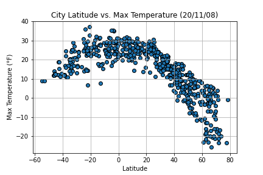
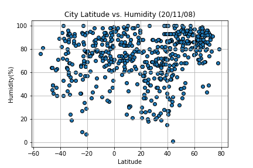
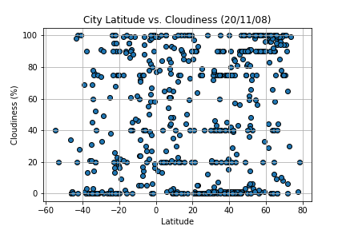
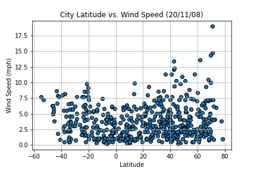

# What's the Weather Like?

## Background

Whether financial, political, or social -- data's true power lies in its ability to answer questions definitively. So let's take what I have learned about Python requests, APIs, and JSON traversals to answer a fundamental question: "What's the weather like as we approach the equator?"

## WeatherPy

In this example, I created a Python script to visualize the weather of 500+ cities across the world of varying distance from the equator. To accomplish this, I utilized a [simple Python library](https://pypi.python.org/pypi/citipy), the [OpenWeatherMap API](https://openweathermap.org/api), and a little common sense to create a representative model of weather across world cities.

The objective is to build a series of scatter plots to showcase the following relationships:
 

The final notebook includes:

* Randomly selected **at least** 500 unique (non-repeat) cities based on latitude and longitude.
* Performed a weather check on each of the cities using a series of successive API calls.
* Included a print log of each city as it's being processed with the city number and city name.
* Save both a CSV of all data retrieved and png images for each scatter plot.

## Observable Trends

* Collecting weather data from random and diverse cities around the world using the OpenWeatherMap API,the data illustrated maximum temperature(in Fahrenheit),humidity(%),cloudiness(%)and wind speed(in mph)with the corresponding city,and with respect to the geo-coordinate,Latitude.
* There seems to be little to no correlation between humidity and Latitude as well as with cloudiness and Latitude. The scatter plot visualizations display a considerable amount of heterogeneity even at similar Latitudes.
* Finally, wind speeds increase in the upper and lower halves on the hemisphere.
* As the correlation coeffient and linear regression model shows a strong negative correlation between latitude and northern hemisphere. Moreover,in southern hemisphere the correlation coefficient and linear regression model shows a positive correlation between latitude and maximum temperature.
* And the correlation coefficent and linear regression model for humidity vs latitude shows a weak positive correlation for both hemispheres.
* The correlation coefficient and linear regression model show a weak positive correlation between cloudiness and latitude in the northern hemisphere and weak positive correlation in the southern hemisphere.
* The correlation coefficient and linear regression model show a weak positive correlation between wind speed(mph) and latitude in the northern hemisphere and shows an almost moderate negative correlation between wind speed(mph) and latitude in the southern hemisphere.
